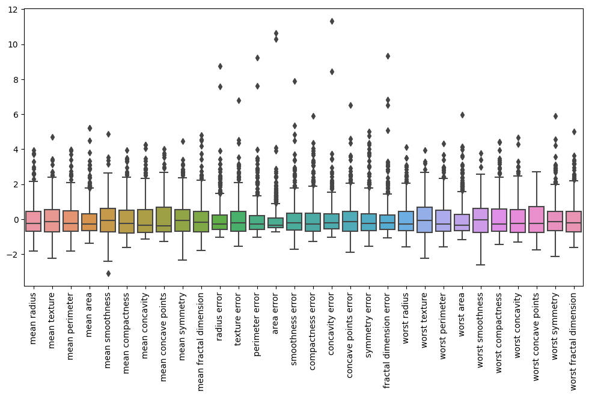
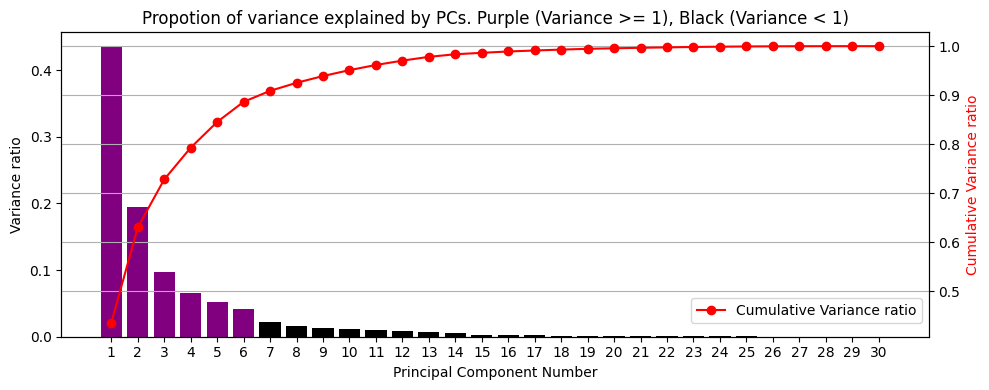
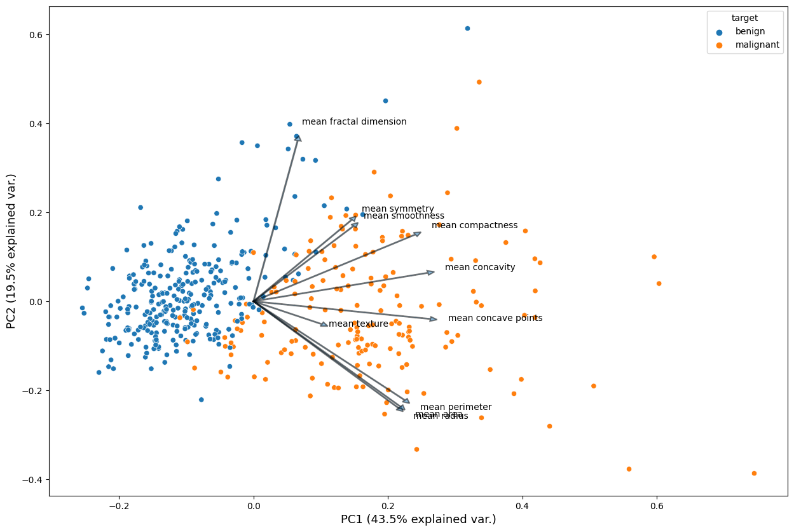
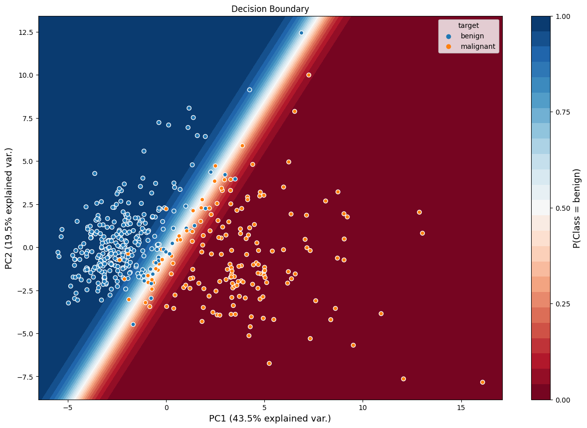

# Principal Component Analysis Summary

PCA is a dimensionality reduction technique used to transform data containing correlated features and noise into a smaller set of uncorrelated features, called principal components. These principal components capture most of the variance in the original data while discarding the remaining variance caused by noise. PCA is commonly used for data exploration and preprocessing.

- These principal components are found to be the eigenvectors of the covariance matrix $C$ of the original data, sorted in descending order of their eigenvalues.
- The first principal component captures the maximum variance, the second principal component captures the second most, and so on.
- The covariance matrix of the projected data on these eigenvectors (principal components) will be a diagonal matrix $\Lambda$ containing eigenvalues on the diagonal. This shows that:
    1) Principal components are uncorrelated due to 0s in the off-diagonal.
    2) Variance explained by a principal component $i$ is eigenvalue $\lambda_i$.
- In relation to SVD, the principal components for data $X$ are the right singular vectors of $X$, and their variance is the square of the singular values of $X$ divided by the sample size $n$.
- According to the trace property: $tr(C) = tr(\Lambda)$, where $\Lambda$ is the diagonal matrix of eigenvalues of the covariance matrix $C$ of the original data, which is also the covariance matrix of the transformed data. This shows that the sum of the variance of all the original features is equal to the sum of the variance explained by all the principal components.
- The explained variance ratio by $PC_i$ is $\lambda_i / tr(C)$.
- A biplot is used to visualize the projection of each vector representing a training example in $n$-dimensional feature space onto PC1 and PC2. The feature vectors are plotted with the dimension of loadings. The loading of a feature $f$ for $PC_i$ is the weight given to that feature in finding the projections of training examples onto $PC_i$. It shows the correlation between the features and principal components. The angle between feature vectors shows the correlation between them. An angle greater than 90, equal to 90, and less than 90 corresponds to a negative, zero, and positive correlation, respectively.
- PCA can be used to preprocess data into transformed data with uncorrelated features and much smaller dimensionality.

# Code Overview
The `PCA.ipynb` applies the PCA on breast cancer data with 30 features. The data projected onto first 2 principal components is then trained using Logistic Regression model to classify malignant and benign. The original data with 30 features gives the accuracy of 97% while PCA processed simple data with 2 features gives 99% accuracy.
### Normalize features:

### Scree plot:

### Biplot:

### Decision Boundary using Logistic Regression:

# Addition in notes
- In notes, the projection of data X onto the unit eigenvectors V of the covariance matrix C is given by:
  
  $P = XV$
  
  Where each row in X represents a data vector (that is, a training example).
  When transposing the matrices, we get:
  
  $P^T = (XV)^T$
  
  $P^T = V^TX^T$

  $P^{'} = V^T X^{'}$
  
  Here, columns of $P^{'}$ and $X^{'}$ represent projected data vectors and the original data vectors, respectively.
  
  This equation demonstrates how $V^T$ gives the rotation that maps or projects the original data vecotrs onto the unit eigenvectors or principal components V.

- Relationship between SVD and PCA is best explained in [PCA, SVD relationship](https://stats.stackexchange.com/questions/134282/relationship-between-svd-and-pca-how-to-use-svd-to-perform-pca)

